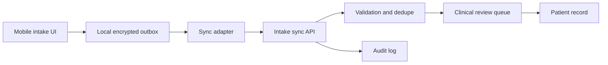

# Field Clinic Intake Sync Plan

## Summary

Build an offline-first intake sync lane for field clinic teams that collect patient intake data without reliable connectivity. The design keeps clinical workflow code separate from transport and storage concerns: mobile clients create signed intake packets, a local outbox retries delivery, and the server validates, deduplicates, and stages packets for review before committing them to the patient record.

## Boundaries

## Proposed Design

- Add an intake packet schema with stable identifiers, timestamps, clinic context, and client-generated idempotency keys.
- Store packets in a local encrypted outbox until the sync API confirms acceptance.
- Introduce a sync adapter that handles retry, backoff, duplicate submission, and network error classification.
- Add a server-side intake sync API that accepts packets, validates schema and authorization, and writes an immutable receipt.
- Route accepted packets into a review queue rather than directly mutating the patient record.
- Promote reviewed packets into the patient record through the existing audited write path.

## Rule And ADR Check

- ADR 0001 is satisfied because client, sync API, review queue, and patient record boundaries are explicit.
- ADR 0002 is satisfied because the sync protocol and packet validation do not depend on a vendor-specific queue or database feature.
- ADR 0003 is satisfied because packet receipt, review, promotion, duplicate detection, and rejection are all auditable.
- Repository rules are satisfied because the work is feature flagged, rollback is possible, and no new persistence model becomes the source of truth.

## Possible Rule Or ADR Tension

This plan does not need to loosen an existing rule. It does create a temporary staging store, but the patient record remains the source of truth and the staging store is not a competing domain model.

## Possible Rule Tightening

Consider adding a rule that offline workflows must define an idempotency key, conflict policy, and explicit reconciliation owner before implementation.

## Alternatives Considered

- Direct write from mobile client to patient record: simpler, but weak conflict handling and worse auditability.
- General-purpose offline framework: broad dependency surface and less control over clinical reconciliation.
- Manual CSV export and import: operationally familiar but error-prone and poor for near-real-time care.

## Rollout

1. Add packet schema, validation tests, and feature flag.
2. Implement local outbox and sync adapter behind the flag.
3. Add server receipt, dedupe, and review queue.
4. Run in shadow mode with packet receipts but no patient record promotion.
5. Enable promotion for one clinic group, then expand after audit review.

## Validation

- Unit-test packet validation, idempotency, and retry classification.
- Integration-test duplicate packets, delayed packets, rejected authorization, and review promotion.
- Add observability for outbox depth, sync success rate, duplicate rate, review latency, and promotion failures.

## Certainty

88 percent. This is the right approach because it preserves source-of-truth boundaries, improves clinical auditability, and has a narrow rollback path.

## TTS Script

This plan adds offline intake syncing for field clinic teams. The mobile app saves encrypted intake packets locally, then a sync adapter retries delivery when the network returns. The server validates each packet, records an auditable receipt, removes duplicates, and sends accepted packets to a clinical review queue. The patient record is only updated through the existing audited path after review. The approach is high confidence because it keeps boundaries clear, avoids vendor lock-in, and makes rollback straightforward.

