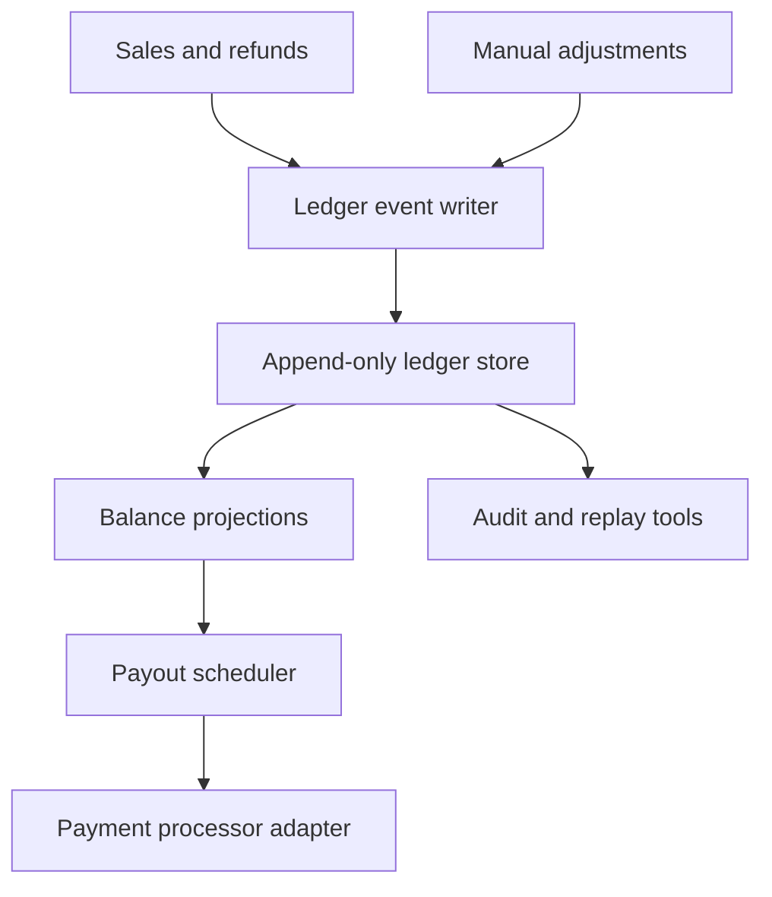

# Creator Payout Ledger Plan

## Summary

Introduce a payout ledger for a creator marketplace so every earning, hold, reversal, tax adjustment, and settlement is replayable and auditable. The preferred design is an append-only event stream with derived balances and settlement projections. This is architecturally significant because it changes how financial state is modeled and may loosen the repository rule against introducing a new persistence model.

## Boundaries

## Proposed Design

- Create immutable ledger events for earning, reserve, release, reversal, fee, tax withholding, and payout settlement.
- Make the append-only ledger the source of truth for creator payout state.
- Build derived balance projections from replayed ledger events.
- Keep payment processor integration at the edge with idempotency keys and reconciliation imports.
- Run a migration that converts current payout rows into opening ledger events.
- Compare old and new balances in shadow mode before switching payout scheduling.

## Rule And ADR Check

- ADR 0001 is partly satisfied because the ledger, projections, scheduler, and processor adapter are explicit boundaries.
- ADR 0002 is at risk if the append-only store relies on database-specific stream semantics.
- ADR 0003 is strongly satisfied because replayable financial events improve auditability.
- Repository rules are in tension because this introduces a new persistence model and source of truth.

## Possible Rule Or ADR Tension

This plan could violate the rule against new persistence models. It may be worth loosening that rule for regulated financial workflows when:

- the existing model cannot explain balance history,
- replay and reconciliation are explicit requirements,
- migration and rollback are documented,
- and shadow comparisons prove parity before cutover.

## Possible Rule Tightening

Consider adding a financial-state rule: any new ledger source of truth must include replay tooling, projection drift alerts, processor reconciliation, and a documented rollback or compensation path.

## Alternatives Considered

- Extend the existing payout table with audit columns: lowest migration cost, but still hard to replay and reason about corrections.
- Add an append-only audit table next to the current state table: safer migration, but keeps two models that can drift.
- Use a managed ledger product: strong audit surface, but vendor lock-in and less portable domain logic.
- Use a relational append-only ledger instead of event sourcing terminology: nearly as auditable and possibly simpler for the team.

## Open Questions

- Does payout history already have enough source data to reconstruct opening events?
- Is strict event replay a product or compliance requirement, or is append-only relational accounting sufficient?
- Which operations team owns manual correction events?
- What latency is acceptable between event write and payout projection availability?

## Rollout

1. Define event taxonomy and invariants.
2. Build migration from existing payout rows into opening events.
3. Implement projections and compare against current balances in shadow mode.
4. Add reconciliation imports from the payment processor.
5. Cut payout scheduling over only after drift is zero for a full payout cycle.

## Validation

- Property-test ledger invariants across reversals, reserves, partial payouts, and processor failures.
- Reconcile migrated balances against historical payout exports.
- Add drift alerts between ledger projections, payment processor reports, and accounting exports.
- Run replay tests against anonymized historical data before cutover.

## Certainty

58 percent. The auditability benefits are real, but the architectural impact is large and the append-only relational alternative is strong enough to justify review before implementation.

## TTS Script

This plan changes creator payouts from mutable payout rows into an auditable ledger. Every earning, hold, reversal, tax adjustment, and payout settlement becomes an immutable event. Balances are projections that can be replayed and checked against the payment processor. The design improves auditability, but it introduces a new source of truth and a new persistence model. Because the existing rule discourages that, and because an append-only relational ledger may be a simpler alternative, this plan should pause for independent architecture feedback before implementation.

