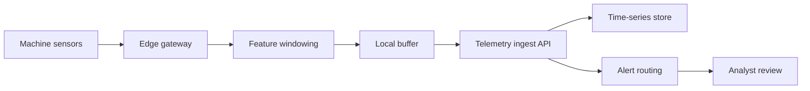

# Factory Edge Anomaly Pipeline Plan

## Summary

Add an edge anomaly pipeline for factory sensor telemetry. Edge gateways compute small feature windows near the machines, buffer results during network outages, and publish normalized anomaly signals to a central ingestion API. The server handles persistence, alert routing, and analyst review. The design avoids putting machine-learning model execution into the core domain and keeps vendor-specific streaming code behind adapters.

## Boundaries

## Proposed Design

- Add a gateway-side feature windowing process that emits normalized anomaly candidates rather than raw high-volume readings.
- Use signed configuration bundles for thresholds, sampling windows, and machine metadata.
- Buffer feature windows locally with bounded retention and explicit drop accounting.
- Add a central telemetry ingest API that validates gateway identity, config version, and schema.
- Persist normalized readings in the existing time-series path and route severe anomalies to the alerting workflow.
- Keep model vendors and stream providers behind adapters so the core anomaly contract remains portable.

## Rule And ADR Check

- ADR 0001 is satisfied because gateway, ingest, storage, alerting, and review boundaries are explicit.
- ADR 0002 is satisfied if vendor stream clients stay behind the ingest adapter and model execution does not leak into core domain types.
- ADR 0003 is satisfied for alert state changes through the existing alert audit path; raw telemetry does not need the same audit treatment.
- Repository rules are satisfied because rollout is feature flagged, rollback can disable gateway publishing, and persistence uses the existing telemetry path.

## Possible Rule Or ADR Tension

The main risk is accidentally coupling the core anomaly contract to a specific stream processor or model vendor. The plan avoids this with normalized messages and edge/vendor adapters. No existing rule needs loosening.

## Possible Rule Tightening

Consider adding an edge-systems rule: any edge workflow must define stale-configuration behavior, local retention limits, drop accounting, and remote disable controls.

## Alternatives Considered

- Send all raw telemetry to the cloud: simpler edge footprint, but high cost and fragile during outages.
- Run full predictive models on the gateway: lower latency, but larger deployment and explainability burden.
- Batch upload daily summaries: cheap, but misses urgent anomalies.
- Buy a vendor-managed monitoring platform: fast start, but weaker portability and harder integration with analyst review.

## Rollout

1. Define the normalized anomaly candidate schema and gateway identity checks.
2. Add feature-windowing on one gateway class behind a remote flag.
3. Publish to a staging ingest endpoint and compare against raw telemetry baselines.
4. Route low-severity alerts to analyst review in shadow mode.
5. Enable high-severity alert routing after false-positive rates stabilize.

## Validation

- Unit-test windowing, schema validation, retention, and drop accounting.
- Integration-test gateway identity, stale config, duplicate windows, and outage recovery.
- Measure ingestion latency, drop counts, false-positive rate, alert review time, and remote-disable propagation.
- Run a rollback drill that disables publishing and drains local buffers.

## Certainty

82 percent. This should proceed because the design keeps vendor dependencies at the edge, uses existing persistence and alerting paths, and has explicit rollback controls.

## TTS Script

This plan adds an edge anomaly pipeline for factory sensors. Gateways near each machine compute small feature windows and buffer them during outages. A central ingest A P I validates gateway identity and schema, stores normalized telemetry, and routes severe anomalies into the existing alert review workflow. The design keeps stream providers and model vendors behind adapters, uses the existing storage path, and can be rolled back by disabling gateway publishing. It is complex, but the surface is controlled enough to proceed.

